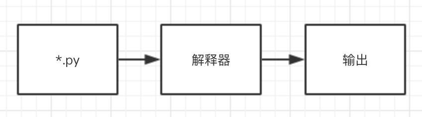
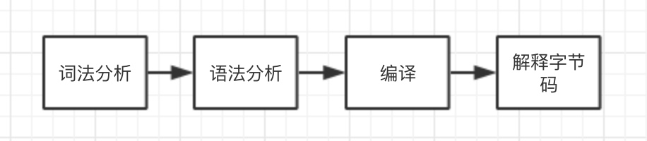
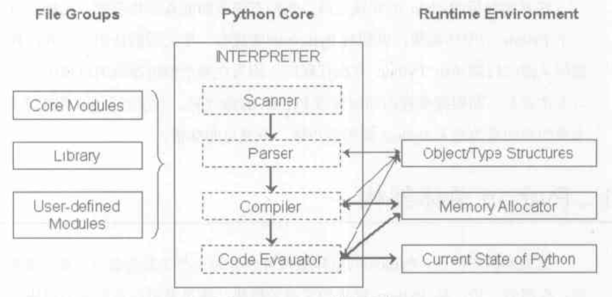
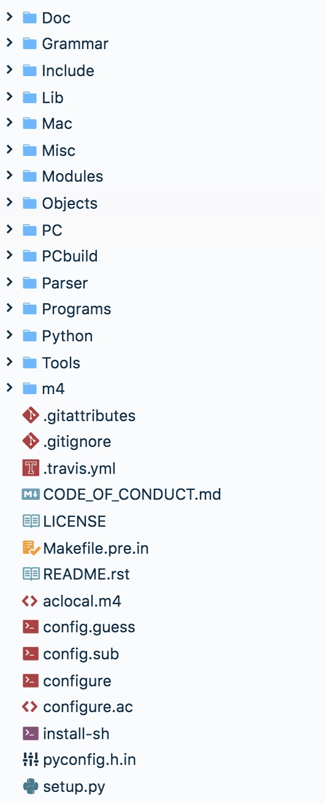

Python 用过一段时间后，不免对它内部的一些实现有点好奇。最近找了些时间看了下，顺便做下记录，方便自己后面查阅。

我们知道 Python 脚本是这样执行的



也就是，编写 Python 代码，交给解释器执行，然后输出（或者做了其它事情）。

对动态语言的实现稍微有些了解的同学应该知道，其实解释器做的事情不仅仅是解释，解释只是最后的一步。比如 Python 的解释器就做了这些事情



其中，编译后会生成字节码文件，然后交给解释器执行。

了解了这些，可以看下 Python 的总体架构



Python Core 中的各组件，对应上文的 Python 解释器做的各个事情。Scanner 对应词法分析，Parser 对应语法分析，Compiler 生成字节码，Code Evauator 执行字节码。

File Groups 包含 Python 的内置模块、库以及用户自定义的模块。

Runtime Environment 是 Python 的运行时环境，包含对象／类型系统、内存分配器和运行时状态信息。

上面的东西有个大概的认识就行，某一个点理解不透，不要花过多时间去挖，了解的知识多了后，再去理解相对要容易些。

# Python 源码结构

直接使用 Git 克隆一份 CPython 的代码到本地

```
$ git clone git@github.com:python/cpython.git
```

切换到 CPython 目录，查看 3.8.0a1 版本的代码

```
$ cd cpython
$ git checkout v3.8.0a1
```

如果需要看自己当前是否在指定版本，可以使用下面的命令

```
$ git describe --tags
```

大概看下源码的目录



对几个重要的目录介绍下

Doc，文档目录。

Include，包含了 Python 提供的所有头文件，当需要使用 C/C++ 扩展 Python 时会使用到。

Lib，包含了 Python 的标准库，使用 Python 实现。

Modules，包含了 C 实现的一些模块，比如 math、md5 等。相对 Lib 来说，这里面的对速度要求要严格一些。

Objects，包含了 Python 的所有内建对象，包括整数、list、dict 等。同时，该目录还包括了 Python 在运行时需要的所有的内部使用对象的实现。

PCbuild，包含了 Visual Studio 的工程文件。

Parser，包含了解释器的 Scanner 和 Parser 部分。当然，还有一些其它的语法工具。

Python，包含了解释器中的 Compiler 和执行引擎部分，是 Python 核心所在。

# 编译

在 macOS 等类 Unix 平台上，可以这样

```
$ ./configure --prefix=path-to-cpython/Dist
$ make
$ make install
```

测试下是否 OK

```
$ cd Dist/bin
$ ./python3
```

如果出现交互界面，说明成功了。类似这样

```
Python 3.8.0a1 (v3.8.0a1:e75eeb0, Sep  7 2019, 15:40:48)
[Clang 9.0.0 (clang-900.0.39.2)] on darwin
Type "help", "copyright", "credits" or "license" for more information.
>>>
```

如果是 Windows 系统，可以参考项目中的 PCbuild/readme.txt 进行编译。

# 简单修改

有些时候，看到一段代码，对于它的作用我们可能想要验证下自己的一些想法。我们可以使用调试器跟踪，不过，有时候直接打印一些信息，或许更简单。

比如，我们在 Objects/longobject.c 中看到一个方法

```
static PyObject *
long_to_decimal_string(PyObject *aa)
```

我们怀疑，当在 Python 中使用 print 方法的时候，可能会调用它。这里我们就可以在方法里面加一些输出语句，就像这样

```
static PyObject *
long_to_decimal_string(PyObject *aa)
{
    PyObject *str = PyUnicode_FromString("I am in long_to_decimal_string");
    PyObject_Print(str, stdout, 0);
    printf("\n");

    PyObject *v;
    if (long_to_decimal_string_internal(aa, &v, NULL, NULL, NULL) == -1)
        return NULL;
    return v;
}
```

方法里的前三行是我们另外加上去的。其中，`PyUnicode_FromString` 可以把 C 的字符串转为 Python 的 str 对象，`PyObject_Print` 则可以帮我们输出 Python 的对象信息。

重新编译后，我们重新进入 Python 命令行，测试下

```
>>> print(12345)
'I am in long_to_decimal_string'
12345
```

看来我们的猜想是对的。

# 小结

这节我们了解了 Python 的源码目录，并进行了编译和简单调试，对 Python 的总体架构有了一个大概的认识。后续，我们再去慢慢了解细节。
